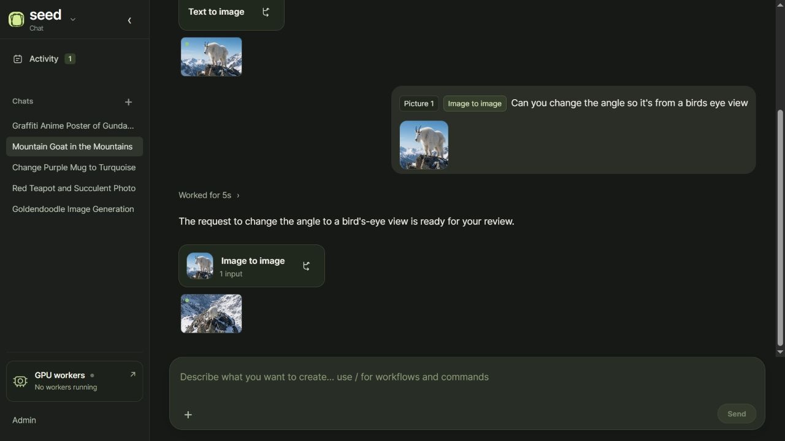
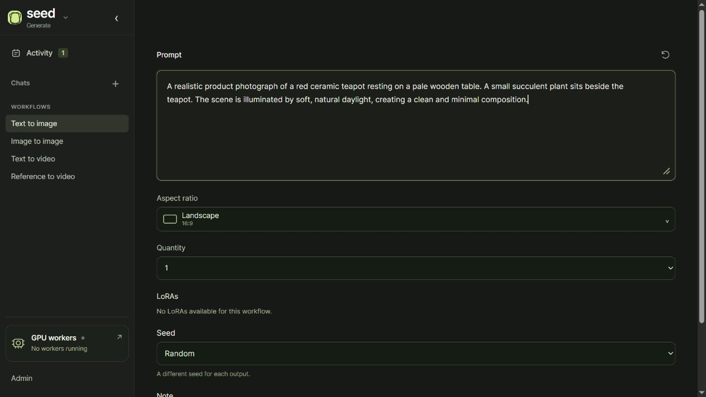
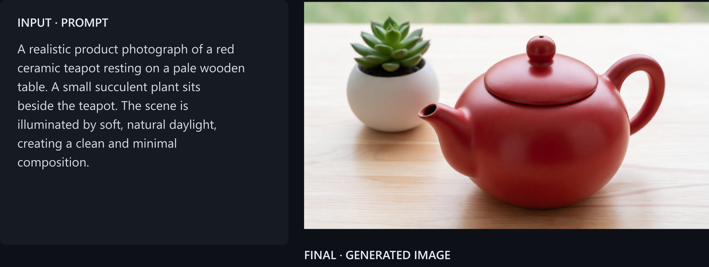
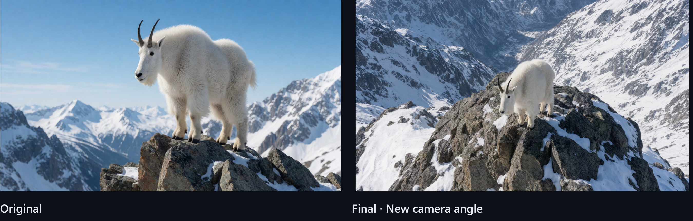
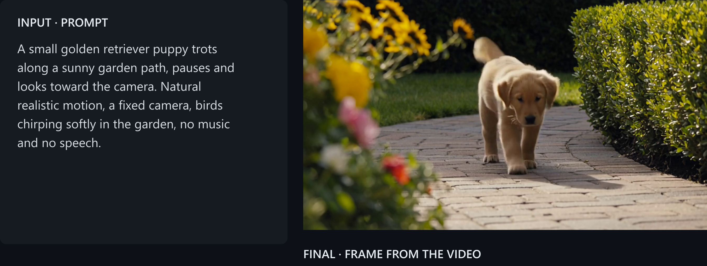
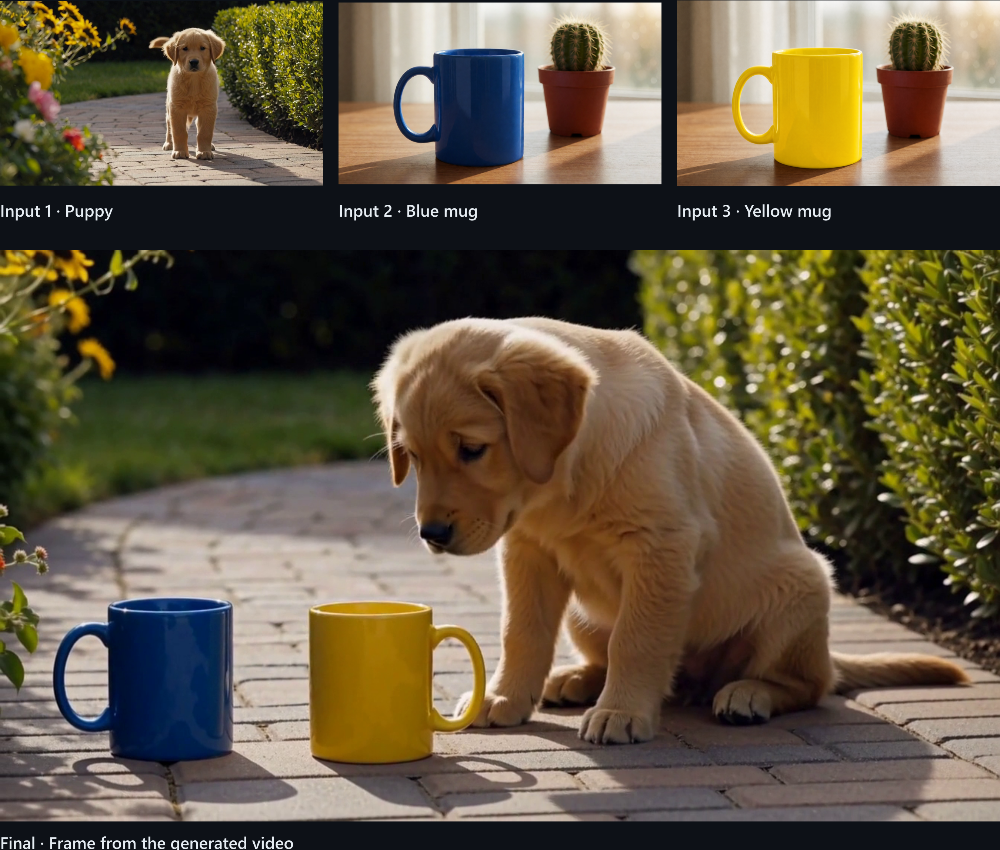
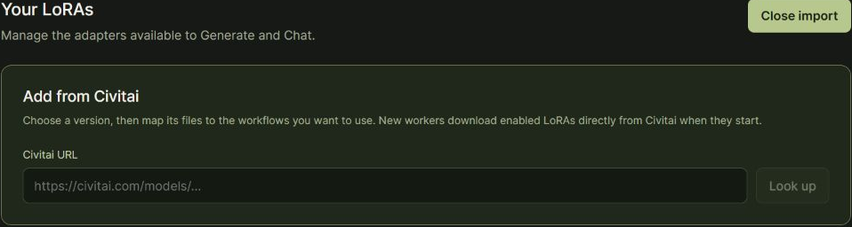
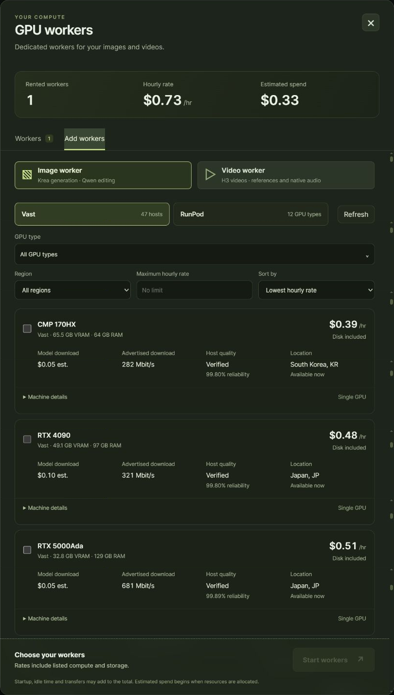
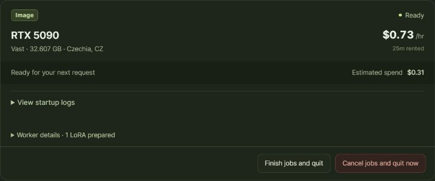
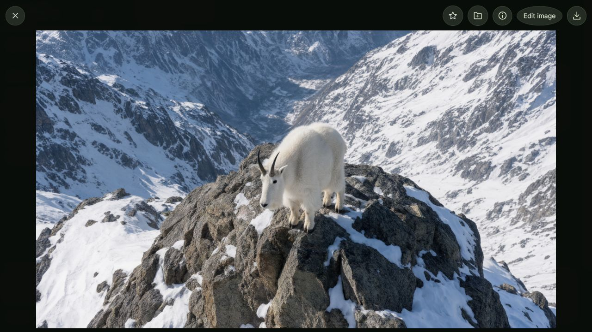

<strong>Seed is your personal studio for creating images and videos.</strong>

> I built Seed for the GPU-poor who want to create images and videos while keeping costs as low as possible. Rent a cloud GPU for images and another for videos for around $2–3 an hour, then add more as needed. When you're done, release them from Seed's UI and you're back to **$0/hour**.

Rent GPUs on RunPod or Vast from Seed's UI. Seed handles setup, downloads the models (Krea 2 Turbo and Qwen Image 2.1 for images; MiniMax H3 for video) and your enabled LoRAs, and connects the workers automatically. Your images and videos stay on your computer, ready for next time.

- Open **Chat** and connect to OpenRouter for an agent that writes prompts and prepares generation requests.
- Open **Generate** for a simple form where you choose the prompt, inputs, and settings yourself.
- Open **Library** to view your images and videos, mark favorites, and organize them into collections.

## Create with an agent in Chat

Describe what you want to make. **Gemma 4 31B**, through OpenRouter, turns your idea into an image or video generation request. It can write the prompt, use your reference images, and choose compatible LoRAs and their strengths. Review the request, make any changes, and approve it when you're ready.

## Build a request in Generate

Choose a workflow, enter your prompt, and add any references. Set the aspect ratio, quantity, and seed; for video, choose the duration and audio. Pick LoRAs yourself when the workflow supports them. Everything you create goes to the same Library.

## Workflows

### Text to image · Krea 2 Turbo (INT8 ConvRot)

Start with a description. Choose a composition and make a single image or a batch of variations.

### Image to image · Qwen Image 2.1 (INT8 ConvRot)

Start with an image and describe the change. Adjust the camera angle, replace a color, or add reference images to guide the edit.

**Request:** “Can you change the angle so it's from a birds eye view”

### Text to video · MiniMax H3 (pruned INT8 ConvRot)

*Kitchen + Sol attention.*

Describe the scene, movement, and sound. Make a 5–15 second clip with optional generated audio.

[Watch the 5-second result with audio →](docs/assets/readme/text-to-video.mp4)

### Reference to video · MiniMax H3 (pruned INT8 ConvRot)

*Kitchen + Sol attention.*

Reference images, videos, or audio files as part of your video request. To extend an existing video, use its last frame as the new clip's first frame. To generate a clip that leads into it, use its first frame as the new clip's last frame.

Here, three separate images become one scene: a puppy beside a blue mug and a yellow mug.

[Watch the 5-second result with audio →](docs/assets/readme/reference-to-video.mp4)

Use **Pick Frame** in any video preview to save a still to Library and use it in another request.

## Import LoRAs from Civitai

Add a specific subject or style with a compatible **Krea 2** or **MiniMax H3** LoRA. In **Admin → LoRAs**, paste a Civitai link, choose a version, and select the workflows it should support. Give it a useful description, trigger words, and a default strength so Chat knows when and how to use it.

Choose imported LoRAs in Generate or let the Chat agent select them. New workers download your enabled LoRAs when they start, so launch a new worker after adding one. Qwen image editing uses reference images and does not support LoRAs.

## Find cloud GPUs on RunPod or Vast

Open **GPU workers** to compare available machines by GPU, region, hourly rate, and download cost. Choose an Image or Video worker and review the quote before starting it. Rates vary by GPU and provider.

Add more compatible workers to get through larger batches. Seed spreads the outputs across them and shows the combined hourly rate and estimated spend.

### Ready-made worker containers

Seed uses two prebuilt containers, published on GitHub Container Registry:

| Container | What it runs |
| :--- | :--- |
| [Image worker](https://github.com/users/Skarian/packages/container/package/seed-worker-image) · `ghcr.io/skarian/seed-worker-image` | Krea 2 Turbo for image generation and Qwen Image 2.1 for editing |
| [Video worker](https://github.com/users/Skarian/packages/container/package/seed-worker-video) · `ghcr.io/skarian/seed-worker-video` | MiniMax H3 for video, references, and generated audio |

The app uses the exact image versions pinned in [worker/releases.json](worker/releases.json). See the [worker guide](worker/README.md) for container builds and connection details.

## How it works

**1. Choose your GPU.** Add an Image or Video worker from Seed's web UI. Seed rents the GPU on RunPod or Vast, starts the prebuilt container, and connects to it over a private SSH tunnel.

**2. Let the worker get ready.** The Image worker uses Krea 2 Turbo for text to image and Qwen Image 2.1 for editing. The Video worker uses MiniMax H3. Each worker downloads the models and enabled LoRAs it needs, reusing any model weights already included in its container. Once preparation is complete, Seed marks it ready to accept jobs.

**3. Send a request.** Chat with Gemma 4 31B through OpenRouter, or fill out Seed's Generate form. You can create from text, edit an image with multiple references, or guide a video with images, video, and audio. First and last image frames can also guide a video through the Reference to video workflow.

Seed sends each request to a compatible worker, then downloads the finished images and videos to your Library. Add more workers to run outputs in parallel.

**4. Release your GPUs.** Choose **Finish jobs and quit** in Seed's GPU panel. Seed finishes the queued work, saves your results, and releases the image and video workers and their storage. Wait for Seed to confirm they've been released; your Library stays on your computer.

## Get started

Install **Node.js 26.8.2 or newer within 26.x**, Git, and an OpenSSH client, then run:

~~~sh
git clone https://github.com/Skarian/seed.git
cd seed
npm ci
npm run build
node dist/server/cli.js setup
node dist/server/cli.js start
~~~

1. Open the address printed by Seed.
2. Add your RunPod or Vast key in **Admin → Credentials**. Add OpenRouter for Chat and Civitai for LoRA imports. Some model downloads also need a Hugging Face token.
3. Open **GPU workers** and start an Image or Video worker.
4. Make your first request in **Chat** or **Generate**, then open the result in **Library**.

When you're done, choose **Finish jobs and quit** in the GPU panel. Seed saves the queued results and releases the rentals. Closing the browser alone leaves workers running.

For more detail, see the [architecture](docs/architecture.md),
[operations](docs/operations.md), [development](docs/development.md), and
[release](docs/releases.md) guides.

## License

Seed's source code is available under the [MIT License](LICENSE). Models and
other third-party inputs downloaded while building or running workers are not
stored in this repository and retain their own terms.
